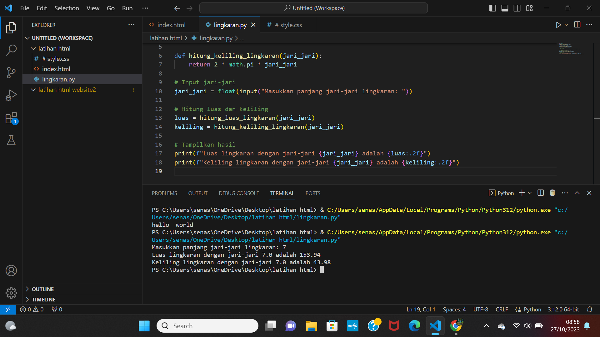

# praktikum3
<h1>LUAS DAN KELILING LINGKARAN</h1>

import math

def hitung_luas_lingkaran(jari_jari):
    return math.pi * jari_jari ** 2

def hitung_keliling_lingkaran(jari_jari):
    return 2 * math.pi * jari_jari

# Input jari-jari
jari_jari = float(input("Masukkan panjang jari-jari lingkaran: "))

# Hitung luas dan keliling
luas = hitung_luas_lingkaran(jari_jari)
keliling = hitung_keliling_lingkaran(jari_jari)

# Tampilkan hasil
print(f"Luas lingkaran dengan jari-jari {jari_jari} adalah {luas:.2f}")
print(f"Keliling lingkaran dengan jari-jari {jari_jari} adalah {keliling:.2f}")

